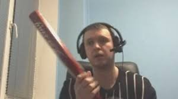
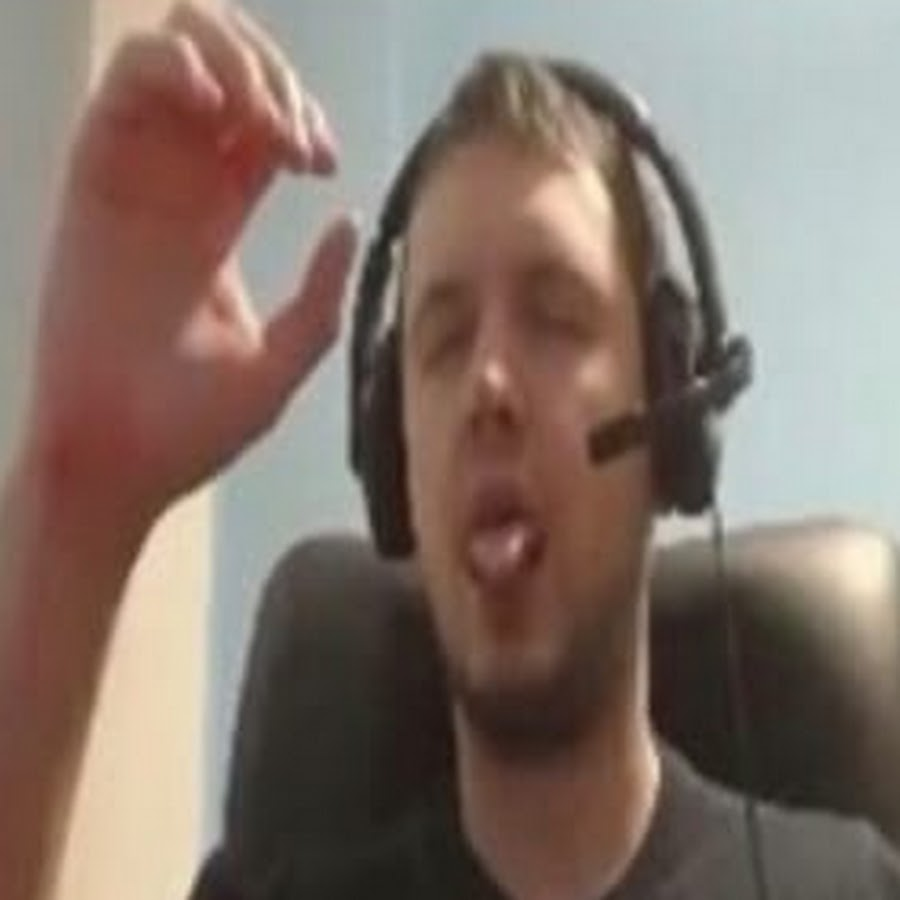

<DOCTYPE html>
<html>
		<head>
			<title>
				dota2

			</title>

		</head>
		<body>
		<h1>ЧТО МОЖНО ПОЛУЧИТЬ ОТ ДОТЫ </h1>
		<strong>1)ДЕПРЕССИВНОЕ РАСТРОИСТВО 
		2)ШИЗОФРИНИЮ 
		3)СУИЦИДАЛЬНЫЕ МЫСЛИ 
		4)Синдром ТУРЕТТЫ   </strong>
		
		

		<h1>Почему нельзя играть в доту2 </h1>
		В доте очень агрессивное и токсичное комьюнити и даже если для вас агрессия чуждо, то через какое то время вы и сами станете агрессивным.  Вас будут унижать, обзывать, фильтров никаких нет, модерации никакой нет, каждый пишет что хочет.  Тотальная вакханалия, если вы считаете что слышали много плохого о себе, смело можете скачивать Доту и получить полное ведро помоев прямо на лицо и пару шуток про "мамку" как правило хорошего тона.
		
		

		

		Огромное количество людей заходят в Доту в состоянии близком к клинической смерти, пьяные или под воздействием препаратов, обиженные на что то или просто в плохом настроении, они испортят настроение вам и будут специально делать все чтобы вы проиграли, вы потратите на них свое время и в процессе только испортите себе настроение.
		

			

					 
					
		
			

		
						<h1>На этом фото вы можете видеть Виталия Цалья,на этом фото он болен шизофриний а бита ему нужна что избить воображаемого врага которая появилась из за доты2  
							А на втором фото вы можете видеть как Виталий занимается любовью со своим воображаваемым бойфрендом</h1></strong> 
				<video controls width="700px">
				
				
				<source src="infinity/video.mp4">
				</video> 
				<strong><hl>А на этом видео можно заметить что Виталий Цаль болеет синдромом туретты опять же из за игры под названием Дота2</hl></strong>
		</body>

</html>
